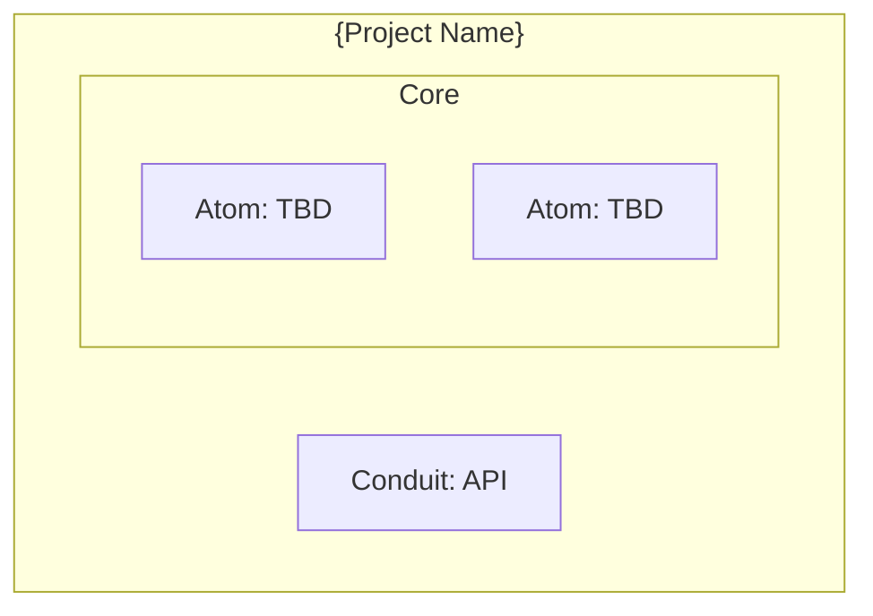

<objective>
Initialize Lucid Composite Architecture (LCA) documentation for the current project. Creates a properly structured ARCHITECTURE.md file with hierarchy navigation, structural components, data strategy, and architectural rules.
</objective>

<phase_1_detection>
**Detect existing architecture documentation:**

1. Check for existing files:
   - `ARCHITECTURE.md` (uppercase - authoritative root)
   - `architecture.md` (lowercase - inherits from parent)
   - `arc-dec.md` (architecture declaration)

2. If ARCHITECTURE.md exists:
   - Read current content
   - Ask user: "Architecture documentation exists. Update it or create fresh?"
   - Options: Update existing | Create new (backup current) | Cancel

3. Detect project context:
   - Check for `.claude/project-info.toon` or `.claude/workspace-info.toon`
   - Identify technology stack from package.json, pyproject.toml, Cargo.toml, etc.
   - Detect existing service/component boundaries
</phase_1_detection>

<phase_2_hierarchy>
**Determine documentation hierarchy level:**

If `$ARGUMENTS` specifies level, use that. Otherwise, detect:

| Indicator | Suggested Level |
|-----------|-----------------|
| Multiple service directories, monorepo | Platform |
| Single repo, multiple modules | Repository |
| Single focused service | Service |
| Subdirectory of larger system | Component |

Use AskUserQuestion to confirm:

"Based on the project structure, this appears to be a **{detected-level}** level project. Is this correct?"

Options:
1. **Platform** - Cross-cutting concerns, multiple services (creates full platform doc structure)
2. **Repository** - Single codebase with modules
3. **Service** - Focused microservice or application
4. **Component** - Part of larger service

**Three-Tier Abstraction Principle:**
- **Platform Level**: Describes intent, contracts, cross-cutting concerns
- **Repository Level**: Describes implementation patterns, internal structure
- **Component Level**: Describes specific modules, APIs, data flows

Each level answers questions appropriate to its scope. Implementation details at platform level = too deep—link to child document instead.

Set navigation headers based on level:
- Platform: No parent, children are repositories/services
- Repository: Parent may be platform, children are services/components
- Service: Parent is platform/repo, children are components
- Component: Parent is service, siblings are other components

**Document Type Hierarchy:**
| Pattern | Role | Trust Level |
|---------|------|-------------|
| `README.md` | Navigation index, entry point | Meta |
| `ARCHITECTURE.md` | Root architecture (uppercase = authoritative) | Highest at level |
| `architecture.md` | Child architecture (lowercase = inherits) | Inherits from parent |
| `{topic}.md` | Focused topic document | Scoped to topic |
| `adr-NNN-{slug}.md` | Decision record | Historical record |
</phase_2_hierarchy>

<phase_2b_platform_docs>
**If Platform level selected, create full platform documentation structure:**

Platform-level documentation requires these focused documents:

| Document | Purpose |
|----------|---------|
| `README.md` | Governance model, naming conventions, navigation index |
| `platform-overview.md` | Executive summary, project map, deployment context |
| `shared-concepts.md` | Domain entities, semantic vocabulary, glossary (the nouns) |
| `communication-protocols.md` | Transport protocols, serialization, message structures (the verbs) |
| `integration-patterns.md` | End-to-end flows, cross-boundary interactions |
| `data-residency.md` | Storage boundaries, sync patterns, privacy |
| `cross-cutting-concerns.md` | Auth, security, observability, error handling |
| `decisions/` | ADR directory (append-only history) |

Ask user which documents to create:

"Platform-level architecture needs multiple focused documents. Which should I create now?"

Options (multi-select):
1. **All platform documents** - Create complete structure (Recommended)
2. **Core only** - README.md, platform-overview.md, ARCHITECTURE.md
3. **Let me pick** - Select specific documents

**Reading Paths to document:**
- Understanding: `platform-overview.md` → `shared-concepts.md` → `communication-protocols.md` → `integration-patterns.md`
- Implementing: Platform doc → Repository `ARCHITECTURE.md` → Component `architecture.md`
- Decisions: `decisions/adr-NNN-*.md`
</phase_2b_platform_docs>

<phase_3_analysis>
**Analyze codebase for LCA components:**

Use Task tool with component-analyzer agent:

```
Analyze this codebase to identify:
1. Potential Atoms (pure functions, value objects, validators)
2. Potential Composites (orchestrators, coordinators, managers)
3. Potential Conduits (API controllers, message handlers, proto files)
4. Deployable Unit structure

Focus on: {detected technology stack}
```

Capture analysis output for inclusion in documentation.
</phase_3_analysis>

<phase_4_generate>
**Generate ARCHITECTURE.md:**

Use the manage-architecture skill to create documentation:

```markdown
# ARCHITECTURE.md
<!-- Status: Draft -->
<!-- Last Updated: {today's date} -->

↑ Parent: {parent link or "None (root)"}
← Siblings: {sibling links or "None"}
↓ Children: {child links or "To be documented"}

## Overview

{Project name} is a {hierarchy-level} level {technology} project following Lucid Composite Architecture (LCA) principles.

**Purpose**: {detected or ask user}
**Scope**: {what's in/out of this architecture boundary}

## Core Principles

This architecture adheres to LCA tenets:
- **Composition over Inheritance**: Behavior composed, never inherited
- **Radical Containment**: Failures contained within boundaries
- **Functional Immutability**: Data immutable by default
- **Simplicity Default**: 80% generic, 20% performance-optimized where proven

## Structural Components

### Atoms
{List from analysis or placeholder}
[*Needs More Depth] - Document pure functions and value objects

### Composites
{List from analysis or placeholder}
[*Needs More Depth] - Document orchestration components

### Conduits
{List from analysis or placeholder}
[*Needs More Depth] - Document API boundaries and versioning

### Deployable Units
{List from analysis or placeholder}

## Data Strategy

### Internal Models
[*Needs Resolution] - Define Single Subject Data Types for core domain

### Boundary Semantics
[*Needs Resolution] - Define Schema.org types for API boundaries

### Mapping Layer
[*Needs More Depth] - Document transformation between internal and external

## Architectural Rules

| Dimension | Rule | Rationale |
|-----------|------|-----------|
| Dependencies | Uni-directional | Flow down or across, never up |
| Data State | Immutable | Enforced via {library TBD} |
| Protocol | {TBD} | Strict contracts at Conduits |
| Modeling | Internal Focus | Schema.org at boundaries only |
| Refactoring | Stable Interface | Implementations can change freely |

## Component Diagram



[*Needs More Depth] - Expand diagram with actual components

## Decision Records

No ADRs yet. Create first ADR with `/architect:adr`.

## Quality Markers

The following items need resolution before this document reaches Stable status:
- [ ] [*Needs Resolution] items addressed
- [ ] [*Needs More Depth] sections elaborated
- [ ] Component analysis reviewed and updated
- [ ] Data strategy defined
- [ ] At least one ADR documenting initial architecture

---

*Generated by architect plugin following LCA principles*
```
</phase_4_generate>

<phase_5_followup>
**Offer next steps:**

After creating ARCHITECTURE.md, present options:

"Architecture documentation initialized with Draft status. What would you like to do next?"

Options:
1. **Analyze components deeper** - Run detailed component analysis
2. **Create initial ADR** - Document the "Why LCA" decision
3. **Review against principles** - Check current code compliance
4. **Done for now** - I'll continue developing later
</phase_5_followup>

<success_criteria>
- ARCHITECTURE.md created at correct location
- Hierarchy level correctly identified
- Navigation headers set appropriately
- Quality markers flag areas needing work
- Draft status accurately reflects initial state
- User informed of next steps
</success_criteria>
