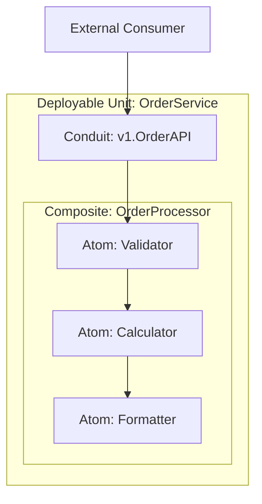
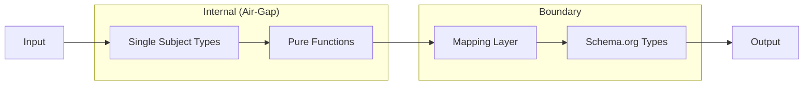

<objective>
Guide architecture documentation following LCA principles: strict containment, radical composition, and evolutionary design. This skill teaches how to document systems as hierarchies of isolated Strata built from Composite Atoms, with functional thinking and universal data modeling.
</objective>

<quick_start>
<workflow>
1. **Assess current state**: Check for existing ARCHITECTURE.md or arc-dec.md
2. **Determine scope level**: Platform, Repository, Application/Service, or Component
3. **Apply maturity status**: Draft → InProgress → Stable → Locked
4. **Document structural components**: Atoms, Composites, Conduits, Deployable Units
5. **Define data strategy**: Internal types → Schema.org at boundaries
6. **Add navigation headers**: ↑ Parent, ↓ Children, ← Siblings
</workflow>

<template>
```markdown
# ARCHITECTURE.md
<!-- Status: Draft | InProgress | Stable | Locked -->
<!-- Last Updated: YYYY-MM-DD -->

↑ Parent: [link] | ← Siblings: [links] | ↓ Children: [links]

## Overview
[High-level purpose and scope]

## Structural Components
### Atoms
[Pure functions, immutable objects, leaf nodes]

### Composites
[Containers that orchestrate Atoms]

### Conduits
[Boundaries between Deployable Units - Protocol Buffers, versioned]

### Deployable Units
[Services with focused scope, idempotent operations]

## Data Strategy
### Internal Models
[Single Subject Data Types - minimal, focused]

### Boundary Semantics
[Schema.org types at API edges]

## Architectural Rules
[Constraints table: Dependencies, Data State, Protocol, etc.]

## Decision Records
[Links to ADRs]
```
</template>
</quick_start>

<core_principles>
<composition_over_inheritance>
Behavior is never inherited—it is composed. If an object needs functionality, it must contain a component that provides it. Systems are assembled like machinery: swap the engine without changing the chassis.

**Rule**: No inheritance for behavior. Use composition exclusively.
</composition_over_inheritance>

<radical_containment>
The "Air-Gap Principle": Modules operate under assumption of hostility.

- **Failure Containment**: Sub-module crashes stay within their boundary
- **Scope Isolation**: Variables and logic invisible unless explicitly exposed via Conduit

**Rule**: Failures never propagate upward. Boundaries are strict.
</radical_containment>

<functional_immutability>
- **Immutable by Default**: Data never mutated in place; create new versions
- **Pure Transformations**: Components as pipelines (Input → Transformation → Output)
- **Side Effects at Boundaries**: I/O pushed to system edges

**Enforcement Libraries**:
- Dart/Flutter: `fpdart`, `freezed`
- Python: `returns`, `immutables`
- TypeScript: `fp-ts`, `immer`
</functional_immutability>

<simplicity_vs_performance>
**Default (80%)**: Generic simplicity—standard list processing, readable transformations

**Performance Tunnel (20%)**: When profiling proves bottleneck, tunnel through abstraction for low-level optimization (memory arenas, bit-masking, zero-copy buffers). Always encapsulate behind standard interface.
</simplicity_vs_performance>
</core_principles>

<structural_anatomy>
<atom>
**The Leaf Node** - Smallest unit of architecture

- Pure functions or immutable objects
- Highly testable
- Where "Performance Tunnel" code lives
- Exposes simple interface regardless of internal complexity

Example: Complex math model in Rust exposing `calculate(input)` interface
</atom>

<composite>
**The Container** - Structural glue

- Does NOT perform business logic—orchestrates Atoms
- Routes data from Atom A to Atom B
- Generic across business domains
- Manages lifecycles and dependencies
</composite>

<conduit>
**The Distributable Boundary** - Between Deployable Units

- Location transparency (network/process boundaries)
- **Protocol Buffers mandatory** for definition
- **Explicitly versioned** (e.g., `v1.PricingService`)
- Enables split/async deployments

Example: `v1.PricingService` → `v2.PricingService` supports old consumers
</conduit>

<deployable_unit>
**The Service** - Runtime manifestation

- Focused scope on specific domain capability
- **Idempotent by Default**: Retrying operations must be safe
- Contains hierarchy of Composites and Atoms
- Is the "Host" for composition
</deployable_unit>
</structural_anatomy>

<data_strategy>
<graph_modeling>
Data as interconnected entities, not rigid tables. Relationships are first-class citizens.

**Apply to**: Relational DB, Graph DB, or in-memory—domain model reflects graph structure.
</graph_modeling>

<boundary_semantics>
At system edges (external APIs, AI agents, LLMs):

- **Schema.org as lingua franca**: Self-describing to automated consumers
- **Serialization**: JSON-LD or Protobuf maps
- **Extensions**: Use standard extension mechanisms, never proprietary root types
</boundary_semantics>

<internal_models>
Inside the air-gap:

- **Single Subject Data Types**: Minimal structures for specific pure functions
- **No Schema.org bloat internally**: Internal types optimized for computation
- **Mapping Layer**: Pure functions transform internal types → Schema.org at egress
</internal_models>
</data_strategy>

<documentation_hierarchy>
<three_tier_abstraction>
**Platform Level** (architecture/)
↓ describes intent, contracts, cross-cutting concerns

**Repository Level** (individual repos)
↓ describes implementation patterns, internal structure

**Component Level** (apps, services, packages)
↓ describes specific modules, APIs, data flows

**Abstraction Principle**: Each level answers questions appropriate to its scope. When describing implementation details at the platform level, you've gone too deep—link to the child document instead.
</three_tier_abstraction>

<document_type_hierarchy>
| Pattern | Role | Trust Level |
|---------|------|-------------|
| `README.md` | Navigation index, entry point | Meta |
| `ARCHITECTURE.md` | Root architecture (uppercase = authoritative) | Highest at level |
| `architecture.md` | Child architecture (lowercase = inherits context) | Inherits from parent |
| `{topic}.md` | Focused topic document | Scoped to topic |
| `adr-NNN-{slug}.md` | Decision record | Historical record |
</document_type_hierarchy>

<platform_documents>
Top-level platform documentation structure:

| Document | Purpose |
|----------|---------|
| `README.md` | Governance model, naming conventions, navigation index |
| `platform-overview.md` | Executive summary, project map, deployment context (30,000 ft view) |
| `shared-concepts.md` | Domain entities, semantic vocabulary, glossary (the nouns) |
| `communication-protocols.md` | Transport protocols, serialization, message structures (the verbs) |
| `integration-patterns.md` | End-to-end flows, cross-boundary interactions |
| `data-residency.md` | Storage boundaries, sync patterns, privacy, data locality |
| `cross-cutting-concerns.md` | Auth, security, observability, error handling |
| `decisions/` | ADR directory (append-only history) |
</platform_documents>

<reading_paths>
**For understanding the platform:**
`platform-overview.md` → `shared-concepts.md` → `communication-protocols.md` → `integration-patterns.md`

**For implementing a feature:**
Platform doc → Repository `ARCHITECTURE.md` → Component `architecture.md`

**For understanding past decisions:**
`decisions/adr-NNN-*.md`
</reading_paths>

<levels>
| Level | Scope | File |
|-------|-------|------|
| Platform | Cross-cutting concerns, architectural vision | `ARCHITECTURE.md` (root) |
| Repository | Specific codebase scope and context | `architecture.md` |
| Application/Service | Service-specific logic and boundaries | `{service}/architecture.md` |
| Component | Deep implementation details | `{component}/architecture.md` |
</levels>

<navigation>
Every architecture document includes navigation headers:

```markdown
↑ Parent: ../ARCHITECTURE.md
← Siblings: ../auth-service/architecture.md, ../billing-service/architecture.md
↓ Children: ./components/cache.md, ./components/validator.md
```

Creates traversable graph for both humans and AI assistants.
</navigation>

<maturity_status>
| Status | Trust | Description |
|--------|-------|-------------|
| Draft | Hypothesis | Not yet reviewed; ideas tentative |
| InProgress | Direction Set | Actively evolving; core direction established |
| Stable | Reliable | Reviewed and reliable; safe to build against |
| Locked | Production Verified | Production-proven; change requires ADR |
</maturity_status>

<quality_markers>
Inline annotations for progressive refinement:

- `[*Needs Resolution]` - Requires decision
- `[*Needs More Depth]` - Requires elaboration
- `[*Needs Verification]` - Requires validation
</quality_markers>
</documentation_hierarchy>

<diagrams>
All diagrams use Mermaid for version control and AI readability.

<scoped_complexity>
Diagrams only depict concepts relevant to their hierarchy level. Link to child documents for deeper details—never explode all complexity in one view.
</scoped_complexity>

<component_diagram>

</component_diagram>

<data_flow>

</data_flow>
</diagrams>

<architectural_rules>
Document constraints in table format:

| Dimension | Rule | Rationale |
|-----------|------|-----------|
| Dependencies | Uni-directional Flow | Cycles create rigid coupling; flow down or across, never up |
| Data State | Enforced Immutability | Use typed libraries to prevent accidental mutation |
| Protocol | Protocol Buffers | Strict contracts at distributable boundaries (Conduits) |
| Modeling | Internal Focus / External Standards | Single Subject Types internal; Schema.org at boundaries |
| Refactoring | Stable Interface / Aggressive Refactor | Interfaces immutable/versioned; implementations ephemeral |
</architectural_rules>

<temporal_strategy>
<interface_stability>
Once a Conduit is published and consumed, it is **immutable**. Changes require new version.

**Result**: Split deployments work; new producer supports old consumers.
</interface_stability>

<aggressive_refactoring>
Behind stable interfaces, refactor aggressively. Air-gap + versioning means internal implementation can be completely rewritten without breaking dependents.
</aggressive_refactoring>

<legacy_encapsulation>
Legacy systems are just another Atom. Wrap in Conduit, contain, interact—preserving modern system integrity.
</legacy_encapsulation>
</temporal_strategy>

<validation>
<checklist>
Before marking documentation Stable:

- [ ] Hierarchy level correctly identified (Platform/Repo/Service/Component)
- [ ] Navigation headers present (↑ ← ↓)
- [ ] Maturity status declared
- [ ] Structural components documented (Atoms, Composites, Conduits, Units)
- [ ] Data strategy defined (internal types, boundary semantics)
- [ ] Architectural rules table included
- [ ] Diagrams scoped to current level only
- [ ] Quality markers resolved or documented
- [ ] Related ADRs linked
</checklist>
</validation>

<reference_guides>
For deeper topics:

- [references/component-patterns.md](references/component-patterns.md) - Atom, Composite, Conduit implementation patterns
- [references/data-modeling.md](references/data-modeling.md) - Schema.org integration, Single Subject Types
- [references/documentation-templates.md](references/documentation-templates.md) - Complete templates by hierarchy level
</reference_guides>

<hierarchy_resolution>
<inheritance_model>
Architecture flows DOWN through the hierarchy. Lower levels inherit constraints from above.

```
LCA Core Principles (this plugin)
    ↓ CANNOT be overridden, only adopted/extended
Platform ARCHITECTURE.md
    ↓ CANNOT be overridden by lower levels
Repository architecture.md
    ↓ CANNOT be overridden by lower levels
Service/Component architecture.md
    ↓ Most specific, applies to local code
```

**Closer to code = applies to code, but CANNOT override higher levels.**
</inheritance_model>

<allowed_actions>
Lower-level architecture may:

- **Extend**: Add detail not specified above
  - Platform: "Use Protocol Buffers" → Service: "Use proto3 with buf validation"

- **Elaborate**: Provide implementation specifics
  - Platform: "Services must be idempotent" → Service: "Via request-id deduplication"

- **Specialize**: Apply general rules to specific context
  - Platform: "Schema.org at boundaries" → Service: "Schema.org/Order for orders API"
</allowed_actions>

<prohibited_actions>
Lower-level architecture may NOT:

- **Override**: Contradict a higher-level decision
  - ❌ Platform: "No inheritance" → Service: "Use inheritance for code reuse"

- **Relax**: Weaken a constraint from above
  - ❌ Platform: "All APIs versioned" → Service: "Internal APIs skip versioning"

- **Ignore**: Omit required elements from above
  - ❌ Platform requires Data Strategy → Service omits section entirely
</prohibited_actions>

<lca_immutable_principles>
These LCA principles CANNOT be overridden by any project architecture:

1. **Composition over Inheritance** - No behavior inheritance
2. **Radical Containment** - Failures contained within boundaries
3. **Functional Immutability** - Data immutable by default
4. **Protocol Buffers for Conduits** - Boundaries use protobufs
5. **Schema.org at Boundaries** - External APIs use Schema.org
6. **Single Subject Types Internally** - Internal types are minimal
7. **Versioned Conduits** - API boundaries are versioned
8. **Uni-directional Dependencies** - No circular dependencies

Project architecture may **adopt and extend** these principles but never contradict them.
</lca_immutable_principles>

<conflict_detection>
When reviewing architecture, check for:

| Conflict Type | Detection | Severity |
|--------------|-----------|----------|
| LCA violation | Statement contradicts core principle | Critical |
| Override | Lower level contradicts higher level | High |
| Relaxation | Lower level weakens constraint | Medium |
| Missing | Required element from above omitted | Medium |
| Inconsistency | Same constraint stated differently | Low |

Use `/architect:review` to run consistency checks across hierarchy.
</conflict_detection>
</hierarchy_resolution>

<success_criteria>
Architecture documentation is complete when:

- Structural hierarchy is clear (what contains what)
- Boundaries are explicit (where Conduits exist)
- Data flow is documented (internal → boundary transformation)
- Maturity status reflects actual review state
- Navigation enables traversal to related documents
- Diagrams support understanding without creating visual complexity
- **Hierarchy consistency verified** (no overrides of higher levels)
- **LCA compliance confirmed** (no violations of core principles)
</success_criteria>
