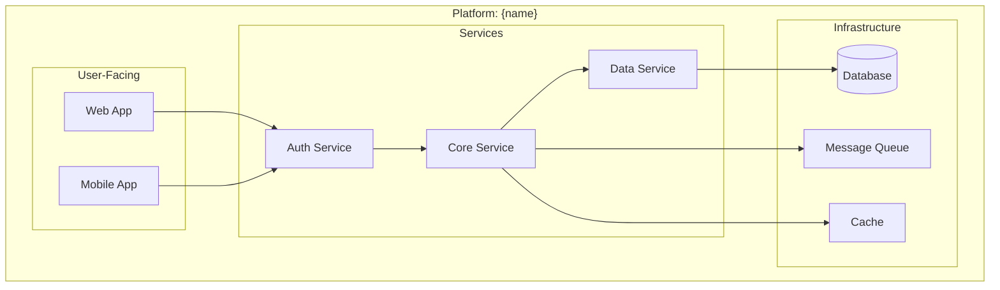
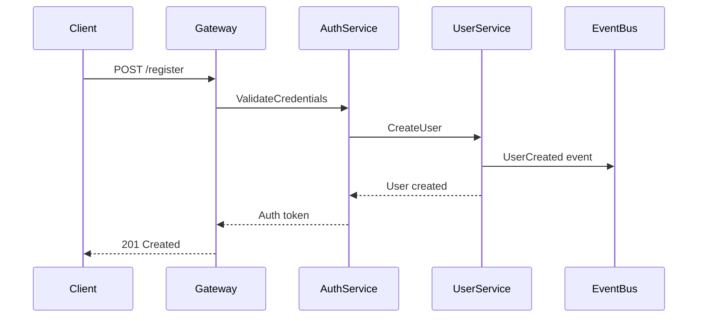
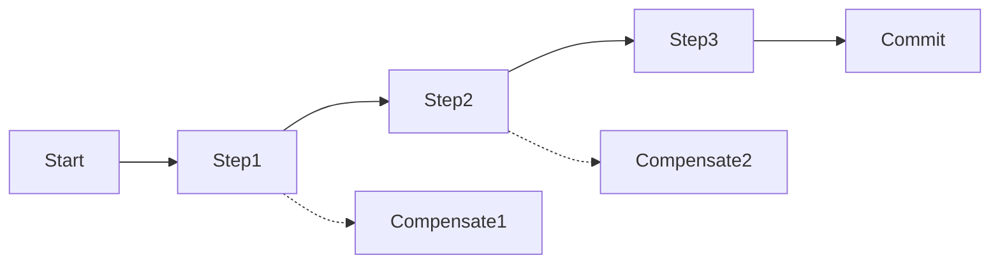
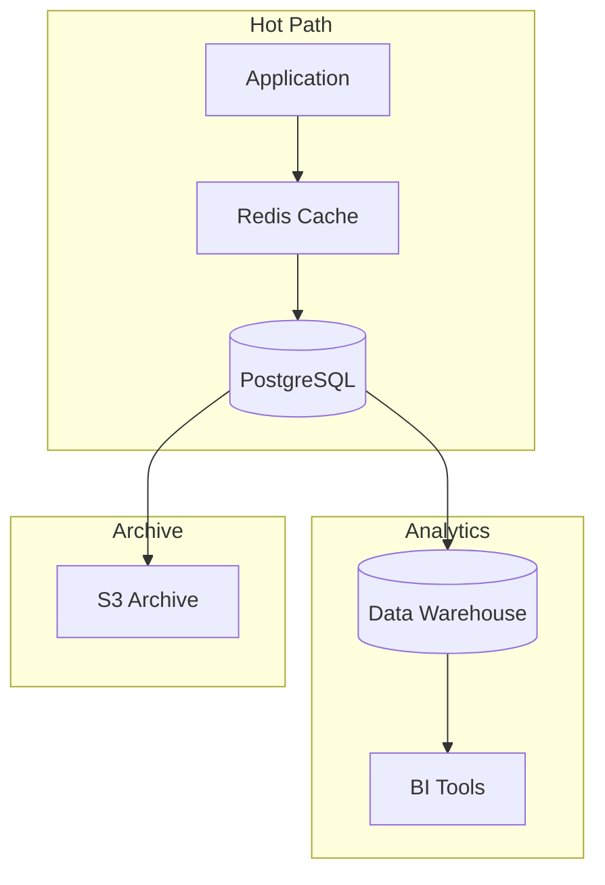
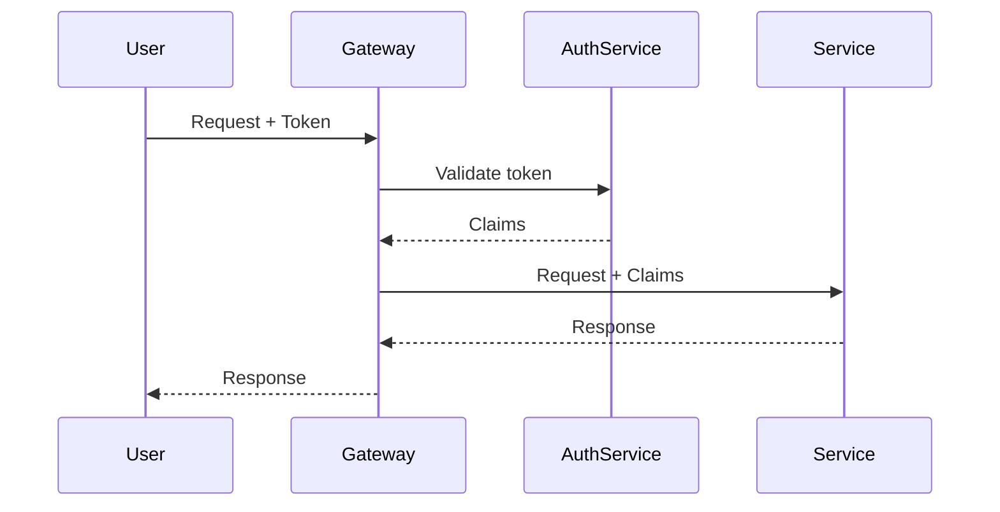
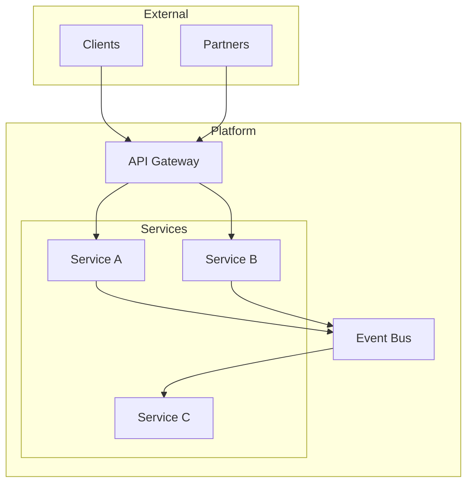
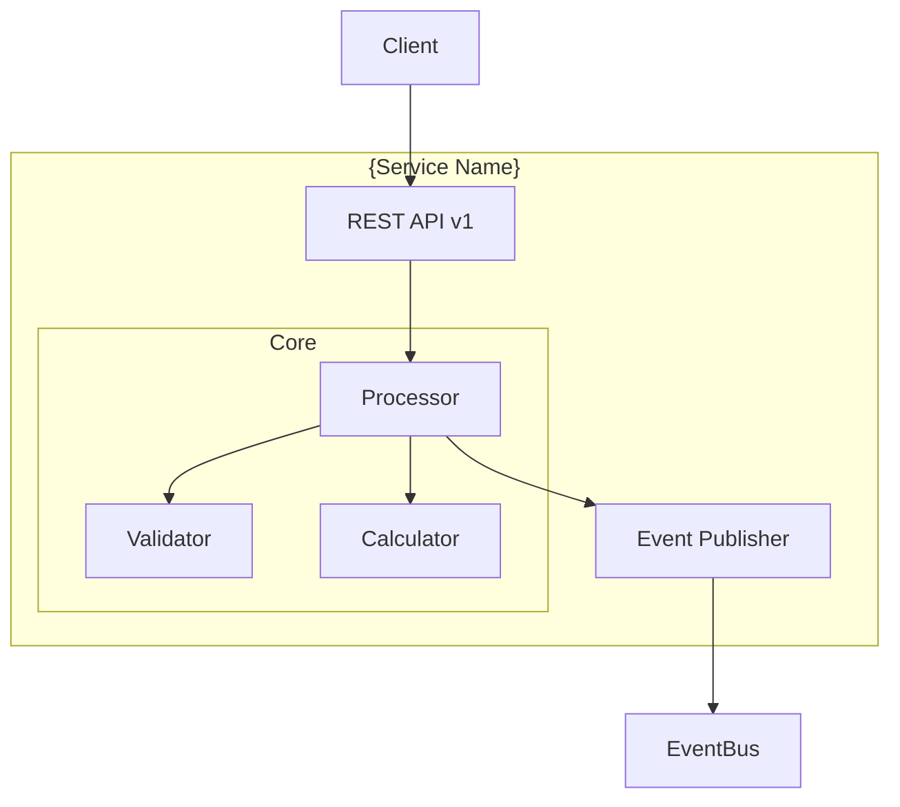
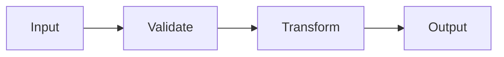

# Documentation Templates

Complete templates for each hierarchy level.

## Three-Tier Abstraction

```
Platform Level (architecture/)
↓ describes intent, contracts, cross-cutting concerns

Repository Level (individual repos)
↓ describes implementation patterns, internal structure

Component Level (apps, services, packages)
↓ describes specific modules, APIs, data flows
```

**Abstraction Principle**: Each level answers questions appropriate to its scope. Implementation details at platform level = too deep—link to child document instead.

## Document Type Hierarchy

| Pattern | Role | Trust Level |
|---------|------|-------------|
| `README.md` | Navigation index, entry point | Meta |
| `ARCHITECTURE.md` | Root architecture (uppercase = authoritative) | Highest at level |
| `architecture.md` | Child architecture (lowercase = inherits) | Inherits from parent |
| `{topic}.md` | Focused topic document | Scoped to topic |
| `adr-NNN-{slug}.md` | Decision record | Historical record |

---

## Platform Documents

Platform-level architecture requires multiple focused documents:

### README.md (Navigation Index)

```markdown
# Architecture Documentation

Navigation index for {platform-name} architecture.

## Reading Paths

**For understanding the platform:**
1. [Platform Overview](platform-overview.md) - The 30,000 foot view
2. [Shared Concepts](shared-concepts.md) - Domain vocabulary and entities
3. [Communication Protocols](communication-protocols.md) - How components talk
4. [Integration Patterns](integration-patterns.md) - End-to-end flows

**For implementing a feature:**
1. Platform doc → Repository ARCHITECTURE.md → Component architecture.md

**For understanding past decisions:**
- [Decision Records](decisions/) - ADRs with context and trade-offs

## Document Index

| Document | Purpose | Status |
|----------|---------|--------|
| [ARCHITECTURE.md](ARCHITECTURE.md) | Root architecture | {status} |
| [platform-overview.md](platform-overview.md) | Executive summary | {status} |
| [shared-concepts.md](shared-concepts.md) | Domain glossary | {status} |
| [communication-protocols.md](communication-protocols.md) | Transport & serialization | {status} |
| [integration-patterns.md](integration-patterns.md) | Cross-boundary flows | {status} |
| [data-residency.md](data-residency.md) | Storage & privacy | {status} |
| [cross-cutting-concerns.md](cross-cutting-concerns.md) | Auth, observability | {status} |

## Governance

- **Naming conventions**: {link or inline}
- **Documentation standards**: {link or inline}
- **Change process**: Changes to Locked docs require ADR

---
*Architecture documentation index*
```

### platform-overview.md (Executive Summary)

```markdown
# Platform Overview
<!-- Status: Draft -->
<!-- Last Updated: YYYY-MM-DD -->

The 30,000 foot view of {platform-name}.

## What Is This Platform?

{2-3 sentence executive summary}

## Project Map



## Repository Structure

| Repository | Purpose | Team |
|------------|---------|------|
| {repo-name} | {brief purpose} | {owning team} |

## Deployment Context

{Where and how this runs - cloud provider, regions, environments}

## Key Metrics

| Metric | Target | Current |
|--------|--------|---------|
| Availability | 99.9% | {current} |
| P99 Latency | <200ms | {current} |

---
*Platform overview - the 30,000 foot view*
```

### shared-concepts.md (The Nouns)

```markdown
# Shared Concepts
<!-- Status: Draft -->
<!-- Last Updated: YYYY-MM-DD -->

The nouns of the system—domain entities, semantic vocabulary, shared language.

## Core Domain Entities

### {Entity Name}

**Definition**: {What this entity represents}

**Attributes**:
| Attribute | Type | Description |
|-----------|------|-------------|
| id | string | Unique identifier |
| {attr} | {type} | {description} |

**Relationships**:
- Has many {related entity}
- Belongs to {parent entity}

**Schema.org Mapping**: `schema.org/{Type}`

## Semantic Vocabulary

| Term | Definition | Context |
|------|------------|---------|
| {term} | {definition} | {where used} |

## Namespace Model

{How multi-tenancy works, organization structure}

```
Organization
└── Workspace
    └── Project
        └── Resource
```

## Entity Identifiers

| Entity | Format | Example |
|--------|--------|---------|
| User | `usr_{ulid}` | `usr_01H5K3...` |
| Order | `ord_{ulid}` | `ord_01H5K3...` |

## Glossary

| Term | Definition |
|------|------------|
| {term} | {definition} |

---
*Shared concepts - the nouns of the system*
```

### communication-protocols.md (The Verbs)

```markdown
# Communication Protocols
<!-- Status: Draft -->
<!-- Last Updated: YYYY-MM-DD -->

The verbs of the system—how components communicate.

## Transport Protocols

| Protocol | Use Case | Services |
|----------|----------|----------|
| gRPC | Internal sync calls | All internal |
| REST/HTTP | External APIs | Public-facing |
| Kafka | Async events | Event-driven |
| WebSocket | Real-time | Client connections |

## Serialization Formats

| Format | Use Case | Schema Location |
|--------|----------|-----------------|
| Protocol Buffers | gRPC messages | `protos/` |
| JSON | REST APIs | OpenAPI specs |
| Avro | Kafka events | Schema Registry |

## Message Structures

### Sync Request/Response

```protobuf
message Request {
  string request_id = 1;
  string correlation_id = 2;
  // payload
}

message Response {
  string request_id = 1;
  oneof result {
    SuccessPayload success = 2;
    ErrorPayload error = 3;
  }
}
```

### Async Events

```json
{
  "@context": "https://schema.org",
  "@type": "Action",
  "@id": "urn:event:{id}",
  "actionStatus": "CompletedActionStatus",
  "object": { "@type": "{EntityType}", "@id": "urn:{entity}:{id}" },
  "startTime": "2025-01-15T10:00:00Z"
}
```

## Versioning Strategy

- **APIs**: URL path versioning (`/v1/`, `/v2/`)
- **Events**: Schema Registry with compatibility checks
- **Protos**: Package versioning (`service.v1`, `service.v2`)

---
*Communication protocols - the verbs of the system*
```

### integration-patterns.md (End-to-End Flows)

```markdown
# Integration Patterns
<!-- Status: Draft -->
<!-- Last Updated: YYYY-MM-DD -->

End-to-end flows—how the nouns move via the verbs.

## Key Flows

### {Flow Name} (e.g., "User Registration")

**Trigger**: {What initiates this flow}
**Outcome**: {What the flow accomplishes}



**Error Handling**:
| Error | Handler | Recovery |
|-------|---------|----------|
| Duplicate email | AuthService | Return 409 Conflict |
| Validation failed | Gateway | Return 400 Bad Request |

### {Another Flow}

{Same structure}

## Cross-Boundary Patterns

### Saga Pattern

Used for: {when to use}



### Event Choreography

Used for: {when to use}

---
*Integration patterns - how components interact*
```

### data-residency.md (Storage & Privacy)

```markdown
# Data Residency
<!-- Status: Draft -->
<!-- Last Updated: YYYY-MM-DD -->

Where data lives—storage boundaries, sync patterns, privacy.

## Storage Boundaries

| Data Type | Primary Store | Sync To | Retention |
|-----------|---------------|---------|-----------|
| User profiles | PostgreSQL | Elasticsearch | Forever |
| Session data | Redis | None | 24h |
| Events | Kafka | S3 (archive) | 90d / 7y |
| Files | S3 | CDN | Per policy |

## Data Flow Diagram



## Sync Patterns

### Primary → Replica

{How data syncs between stores}

### Event Sourcing

{If applicable}

## Privacy Considerations

| Data Category | Classification | Handling |
|---------------|----------------|----------|
| PII | Sensitive | Encrypted, access-logged |
| Financial | Regulated | Encrypted, audited |
| Analytics | Internal | Anonymized |

## Data Locality

| Region | Services | Data Store |
|--------|----------|------------|
| us-east-1 | Primary | PostgreSQL, Redis |
| eu-west-1 | Secondary | Read replica |

---
*Data residency - where data lives*
```

### cross-cutting-concerns.md (Auth, Observability)

```markdown
# Cross-Cutting Concerns
<!-- Status: Draft -->
<!-- Last Updated: YYYY-MM-DD -->

Concerns that span all components—auth, security, observability, errors.

## Authentication & Authorization

### Auth Flow



### Token Format

{JWT structure, claims, etc.}

### Authorization Model

{RBAC, ABAC, policies}

## Security

### Network Security

- mTLS between services
- WAF at edge
- Network policies in k8s

### Secrets Management

- Vault for secrets
- Rotation policy: {frequency}
- Access: Service accounts only

## Observability

### Logging

| Level | Use | Retention |
|-------|-----|-----------|
| ERROR | Failures | 90 days |
| WARN | Anomalies | 30 days |
| INFO | Operations | 14 days |
| DEBUG | Development | 1 day |

**Format**: Structured JSON
**Correlation**: `trace_id`, `span_id`, `request_id`

### Metrics

| Metric | Type | Labels |
|--------|------|--------|
| `request_duration_seconds` | Histogram | service, method, status |
| `request_total` | Counter | service, method, status |
| `active_connections` | Gauge | service |

### Tracing

- OpenTelemetry instrumentation
- Sampling: 1% production, 100% staging
- Trace propagation: W3C Trace Context

## Error Handling

### Error Response Format

```json
{
  "error": {
    "code": "VALIDATION_ERROR",
    "message": "Human readable message",
    "details": [
      { "field": "email", "issue": "Invalid format" }
    ],
    "request_id": "req_123"
  }
}
```

### Error Categories

| Category | HTTP Status | Retry |
|----------|-------------|-------|
| Validation | 400 | No |
| Auth | 401/403 | No |
| Not Found | 404 | No |
| Rate Limit | 429 | Yes (backoff) |
| Server Error | 500 | Yes (limited) |

---
*Cross-cutting concerns - auth, security, observability, errors*
```

---

## Platform Level Template

For cross-cutting concerns spanning multiple services.

```markdown
# ARCHITECTURE.md
<!-- Status: Draft -->
<!-- Last Updated: YYYY-MM-DD -->

↑ Parent: None (root)
← Siblings: None
↓ Children: [services/*/architecture.md]

## Platform Overview

{Platform name} is the architectural foundation for {organization/product}.

**Vision**: {What this platform enables}
**Scope**: {Boundaries of the platform}

## Core Services

| Service | Purpose | Status |
|---------|---------|--------|
| {service-name} | {brief purpose} | {operational/development} |

## Cross-Cutting Concerns

### Authentication & Authorization
{How auth works across services}

### Observability
{Logging, metrics, tracing strategy}

### Data Consistency
{How data consistency is maintained}

## Platform Architecture



## Deployment Topology

{How services are deployed, infrastructure overview}

## Decision Records

| ADR | Title | Status |
|-----|-------|--------|
| [001](adr/adr-001-platform-foundation.md) | Platform Foundation | Accepted |

---
*Platform-level architecture documentation*
```

## Service Level Template

For focused microservices or applications.

```markdown
# architecture.md
<!-- Status: Draft -->
<!-- Last Updated: YYYY-MM-DD -->

↑ Parent: ../../ARCHITECTURE.md
← Siblings: ../other-service/architecture.md
↓ Children: components/*/architecture.md

## Service Overview

{Service name} provides {capability} for the platform.

**Domain**: {Business domain this serves}
**Team**: {Owning team}

## Structural Components

### Atoms

| Atom | Location | Responsibility |
|------|----------|----------------|
| Validator | `src/core/validator.ts` | Input validation |
| Calculator | `src/core/calculator.ts` | Business calculations |

### Composites

| Composite | Location | Orchestrates |
|-----------|----------|--------------|
| Processor | `src/services/processor.ts` | Validator, Calculator |

### Conduits

| Conduit | Type | Version | Schema |
|---------|------|---------|--------|
| REST API | HTTP | v1 | `api/openapi.yaml` |
| Events | Kafka | v1 | `events/schemas/` |

## Data Strategy

### Internal Models

```typescript
// Core domain types (Single Subject)
interface {TypeName} {
  // minimal, focused fields
}
```

### Boundary Types

- **API**: Schema.org/{Type}
- **Events**: Schema.org/{Type}

## Service Diagram



## Dependencies

| Dependency | Type | Purpose |
|------------|------|---------|
| {service} | Sync | {why} |
| {database} | Data | {why} |

## Operations

### Health Checks
- `/health/live` - Liveness
- `/health/ready` - Readiness

### Metrics
- `{service}_requests_total`
- `{service}_latency_seconds`

---
*Service-level architecture documentation*
```

## Component Level Template

For deep implementation details within a service.

```markdown
# architecture.md
<!-- Status: Draft -->
<!-- Last Updated: YYYY-MM-DD -->

↑ Parent: ../../architecture.md
← Siblings: ../other-component/architecture.md
↓ Children: None

## Component Overview

{Component name} handles {specific responsibility}.

## Implementation

### Atom Details

**{Atom Name}**

```typescript
// Key interfaces and signatures
interface Input { }
interface Output { }
function process(input: Input): Output
```

**Purity**: Pure / Mostly Pure
**Side Effects**: None / {list if any}

### Internal Flow



## Performance Considerations

{If this component uses Performance Tunnel}

**Optimization**: {what's optimized}
**Profiling Evidence**: {link to metrics/benchmarks}
**Encapsulation**: {how complexity is hidden}

## Testing Strategy

- Unit tests: `__tests__/{component}.test.ts`
- Property tests: {if applicable}

---
*Component-level architecture documentation*
```

## Navigation Header Patterns

```markdown
<!-- Root document -->
↑ Parent: None (root)
← Siblings: None
↓ Children: services/auth/architecture.md, services/billing/architecture.md

<!-- Service document -->
↑ Parent: ../../ARCHITECTURE.md
← Siblings: ../billing/architecture.md, ../shipping/architecture.md
↓ Children: components/validator/architecture.md

<!-- Component document (leaf) -->
↑ Parent: ../../architecture.md
← Siblings: ../formatter/architecture.md
↓ Children: None
```

## Quality Marker Usage

```markdown
## Data Strategy

[*Needs Resolution] - Choose between REST and gRPC for internal communication

### Internal Models

[*Needs More Depth] - Document the Order aggregate structure

### Boundary Types

[*Needs Verification] - Confirm Schema.org/Order covers all required fields
```
