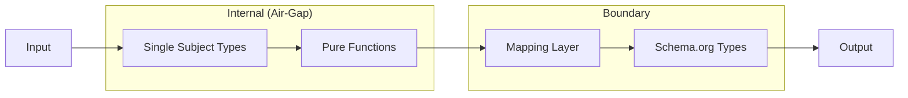

# ARCHITECTURE.md
<!-- Status: Draft -->
<!-- Last Updated: YYYY-MM-DD -->

↑ Parent: {parent-link-or-none}
← Siblings: {sibling-links-or-none}
↓ Children: {child-links-or-to-be-documented}

## Overview

{Project name} is a {hierarchy-level} level {technology} project following Lucid Composite Architecture (LCA) principles.

**Purpose**: {What this system does and why it exists}

**Scope**: {What's in and out of this architecture boundary}

## Core Principles

This architecture adheres to LCA tenets:

| Principle | Application |
|-----------|-------------|
| Composition over Inheritance | {How behavior is composed, not inherited} |
| Radical Containment | {How failures are isolated} |
| Functional Immutability | {How data stays immutable} |
| Simplicity Default | {80/20 split between generic and optimized} |

## Structural Components

### Atoms

Pure functions and immutable objects. The leaf nodes of composition.

| Atom | Location | Responsibility |
|------|----------|----------------|
| {Name} | `{path}` | {What it does} |

[*Needs More Depth] - Document all pure functions and value objects

### Composites

Containers that orchestrate Atoms. Route data, manage lifecycles.

| Composite | Location | Orchestrates |
|-----------|----------|--------------|
| {Name} | `{path}` | {List of Atoms} |

[*Needs More Depth] - Document orchestration patterns

### Conduits

Boundaries between Deployable Units. Protocol Buffers, versioned.

| Conduit | Protocol | Version | Consumers |
|---------|----------|---------|-----------|
| {Name} | {grpc/rest/event} | v{N} | {Who consumes} |

[*Needs Resolution] - Define API versioning strategy

### Deployable Units

Self-contained services with entry points and deployment config.

| Unit | Entry Point | Conduits |
|------|-------------|----------|
| {Name} | `{path}` | {List of Conduits} |

## Data Strategy

### Internal Models

Single Subject Data Types - minimal structures for specific computations.

```
{Example internal type definition}
```

[*Needs Resolution] - Define core domain types

### Boundary Semantics

Schema.org types at API edges for AI/LLM interoperability.

| Internal Type | Schema.org Type | Mapping |
|---------------|-----------------|---------|
| {InternalType} | {schema.org/Type} | {transformation} |

[*Needs Resolution] - Select Schema.org types for boundaries

### Mapping Layer

Pure functions transforming internal ↔ external representations.

```
{Example mapping function}
```

## Architectural Rules

| Dimension | Rule | Rationale |
|-----------|------|-----------|
| Dependencies | Uni-directional | Flow down or across, never up |
| Data State | Immutable | Enforced via {library} |
| Protocol | {Protocol Buffers/REST/etc} | Strict contracts at Conduits |
| Modeling | Internal Focus | Schema.org at boundaries only |
| Refactoring | Stable Interface | Implementations can change freely |

## Component Diagram

```mermaid
graph TB
    subgraph "Deployable Unit: {Name}"
        C1[Conduit: {API}]
        subgraph "Core"
            COMP1[Composite: {Name}]
            A1[Atom: {Name}]
            A2[Atom: {Name}]
        end
    end

    External[External Consumer] --> C1
    C1 --> COMP1
    COMP1 --> A1
    COMP1 --> A2
```

[*Needs More Depth] - Expand with actual components

## Data Flow



## Decision Records

| ADR | Title | Status |
|-----|-------|--------|
| [001](adr/adr-001-initial-architecture.md) | Initial Architecture | Accepted |

## Quality Markers

Resolve before advancing to Stable status:

- [ ] All [*Needs Resolution] items addressed
- [ ] All [*Needs More Depth] sections elaborated
- [ ] Component analysis reviewed
- [ ] Data strategy defined with Schema.org mappings
- [ ] At least one ADR documenting key decisions

---

*Following Lucid Composite Architecture (LCA) principles*
