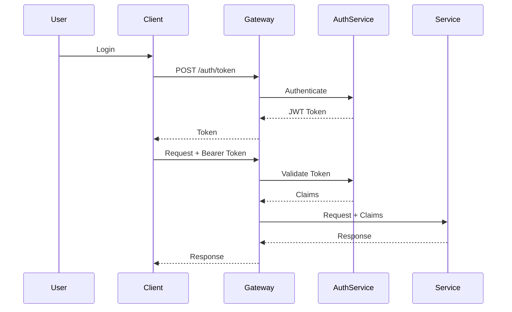
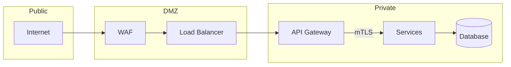
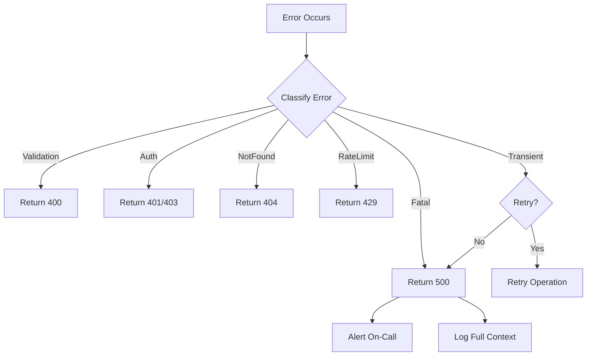

# Cross-Cutting Concerns
<!-- Status: Draft -->
<!-- Last Updated: YYYY-MM-DD -->

Concerns that span all components—auth, security, observability, errors.

## Authentication & Authorization

### Authentication Flow



### Token Format (JWT)

```json
{
  "header": {
    "alg": "RS256",
    "typ": "JWT",
    "kid": "{key-id}"
  },
  "payload": {
    "sub": "usr_01H5K3...",
    "iss": "https://auth.{domain}",
    "aud": ["api.{domain}"],
    "exp": 1234567890,
    "iat": 1234567800,
    "scope": ["read", "write"],
    "org_id": "org_01H5K3...",
    "roles": ["admin", "user"]
  }
}
```

### Authorization Model

**Model**: Role-Based Access Control (RBAC) + Resource Policies

| Role | Permissions | Scope |
|------|-------------|-------|
| admin | All | Organization |
| member | Read, Write own | Workspace |
| viewer | Read | Project |

**Policy Evaluation**:
1. Check token validity
2. Extract user roles
3. Check resource ownership
4. Evaluate RBAC rules
5. Allow or deny

## Security

### Network Security



**Controls**:
- WAF: OWASP Top 10 protection
- mTLS: Service-to-service encryption
- Network policies: Pod-to-pod restrictions
- Private subnets: No direct internet access

### Secrets Management

| Secret Type | Storage | Rotation | Access |
|-------------|---------|----------|--------|
| API keys | Vault | 90 days | Service account |
| DB credentials | Vault | 30 days | Service account |
| JWT signing keys | Vault | 365 days | Auth service only |
| TLS certificates | Cert Manager | 90 days | Automatic |

### Security Headers

```
Strict-Transport-Security: max-age=31536000; includeSubDomains
Content-Security-Policy: default-src 'self'
X-Content-Type-Options: nosniff
X-Frame-Options: DENY
X-XSS-Protection: 1; mode=block
```

## Observability

### Logging

**Format**: Structured JSON

```json
{
  "timestamp": "2025-01-15T10:00:00.000Z",
  "level": "INFO",
  "service": "order-service",
  "trace_id": "abc123",
  "span_id": "def456",
  "request_id": "req_789",
  "message": "Order created",
  "context": {
    "order_id": "ord_01H5K3...",
    "user_id": "usr_01H5K3..."
  }
}
```

**Levels**:

| Level | Use | Retention | Alert |
|-------|-----|-----------|-------|
| ERROR | Failures requiring attention | 90 days | Yes |
| WARN | Anomalies, degradation | 30 days | Threshold |
| INFO | Business operations | 14 days | No |
| DEBUG | Development details | 1 day | No |

### Metrics

**Naming Convention**: `{service}_{subsystem}_{metric}_{unit}`

| Metric | Type | Labels | Purpose |
|--------|------|--------|---------|
| `http_request_duration_seconds` | Histogram | service, method, status, path | Latency |
| `http_requests_total` | Counter | service, method, status | Traffic |
| `db_connections_active` | Gauge | service, pool | Resources |
| `business_orders_total` | Counter | service, status | Business KPI |

**SLIs**:
- Availability: `sum(rate(http_requests_total{status!~"5.."})) / sum(rate(http_requests_total))`
- Latency: `histogram_quantile(0.99, rate(http_request_duration_seconds_bucket))`

### Tracing

**Standard**: OpenTelemetry with W3C Trace Context

**Propagation Headers**:
```
traceparent: 00-{trace-id}-{span-id}-01
tracestate: {vendor-specific}
```

**Sampling**:
| Environment | Rate | Rationale |
|-------------|------|-----------|
| Production | 1% | Cost management |
| Staging | 100% | Full visibility |
| Development | 100% | Debugging |

## Error Handling

### Error Response Format

```json
{
  "error": {
    "code": "VALIDATION_ERROR",
    "message": "Invalid request parameters",
    "details": [
      {
        "field": "email",
        "issue": "Invalid email format",
        "value": "not-an-email"
      }
    ],
    "request_id": "req_01H5K3...",
    "documentation_url": "https://docs.{domain}/errors/VALIDATION_ERROR"
  }
}
```

### Error Categories

| Category | Code | HTTP | gRPC | Retry | User Message |
|----------|------|------|------|-------|--------------|
| Validation | VALIDATION_ERROR | 400 | 3 | No | Fix input |
| Authentication | UNAUTHENTICATED | 401 | 16 | No | Login again |
| Authorization | PERMISSION_DENIED | 403 | 7 | No | Contact admin |
| Not Found | NOT_FOUND | 404 | 5 | No | Check ID |
| Conflict | ALREADY_EXISTS | 409 | 6 | No | Use existing |
| Rate Limited | RATE_LIMITED | 429 | 8 | Yes | Wait and retry |
| Internal | INTERNAL_ERROR | 500 | 13 | Yes | Try again later |
| Unavailable | SERVICE_UNAVAILABLE | 503 | 14 | Yes | Try again later |

### Error Handling Flow



## Related Documents

- [Communication Protocols](communication-protocols.md) - Error codes per protocol
- [Data Residency](data-residency.md) - Security and compliance

---

*Cross-cutting concerns - auth, security, observability, errors*
