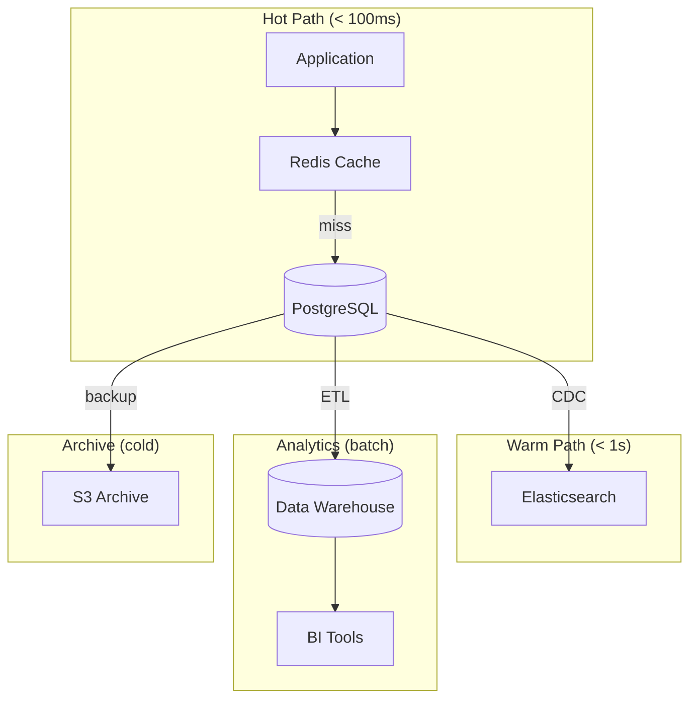

# Data Residency
<!-- Status: Draft -->
<!-- Last Updated: YYYY-MM-DD -->

Where data lives—storage boundaries, sync patterns, privacy.

## Storage Boundaries

| Data Type | Primary Store | Sync To | Retention | Backup |
|-----------|---------------|---------|-----------|--------|
| User profiles | PostgreSQL | Elasticsearch | Forever | Daily |
| Session data | Redis | None | 24h | None |
| Events | Kafka | S3 (archive) | 90d hot / 7y cold | Continuous |
| Files/Media | S3 | CDN | Per policy | Cross-region |
| Audit logs | PostgreSQL | S3 | 7 years | Daily |

## Data Flow Diagram

## Sync Patterns

### Primary → Replica (PostgreSQL)

- **Method**: Streaming replication
- **Lag SLA**: < 100ms
- **Failover**: Automatic via {tool}

### Primary → Search (Elasticsearch)

- **Method**: Change Data Capture (Debezium)
- **Lag SLA**: < 5 seconds
- **Conflict resolution**: Last-write-wins

### Event Sourcing

{If applicable}

- **Event store**: {location}
- **Snapshot frequency**: {interval}
- **Rebuild time**: {estimate}

## Privacy Considerations

### Data Classification

| Category | Examples | Classification | Handling |
|----------|----------|----------------|----------|
| PII | Email, phone, address | Sensitive | Encrypted at rest, access-logged |
| Financial | Payment info, transactions | Regulated | Encrypted, PCI compliance |
| Authentication | Passwords, tokens | Secret | Hashed (bcrypt), never logged |
| Analytics | Usage metrics | Internal | Anonymized after 30d |
| Public | Product descriptions | Public | No restrictions |

### Encryption

| Layer | Method | Key Management |
|-------|--------|----------------|
| At rest | AES-256 | AWS KMS |
| In transit | TLS 1.3 | Cert Manager |
| Application | Field-level | Vault |

### Right to Deletion (GDPR)

1. User requests deletion via API
2. Soft-delete: Mark as deleted, remove from search
3. Hard-delete: Purge after 30d grace period
4. Audit: Log deletion for compliance

## Data Locality

### Geographic Distribution

| Region | Role | Services | Data Store |
|--------|------|----------|------------|
| us-east-1 | Primary | All | PostgreSQL (primary), Redis |
| us-west-2 | Failover | All | PostgreSQL (replica), Redis |
| eu-west-1 | EU data | EU traffic | PostgreSQL (EU users), Redis |

### Data Sovereignty

| Data Type | Allowed Regions | Restriction |
|-----------|-----------------|-------------|
| EU user PII | eu-west-1 only | GDPR |
| Financial | us-east-1, us-west-2 | SOC2 |
| General | Any | None |

## Backup & Recovery

### Backup Schedule

| Data | Frequency | Retention | Location |
|------|-----------|-----------|----------|
| PostgreSQL | Continuous WAL + Daily full | 30d | S3 cross-region |
| Redis | Hourly snapshot | 7d | S3 |
| S3 | Versioning | 90d | Same bucket |

### Recovery Objectives

| Metric | Target | Current |
|--------|--------|---------|
| RPO (data loss) | < 1 hour | {current} |
| RTO (downtime) | < 4 hours | {current} |

## Related Documents

- [Shared Concepts](shared-concepts.md) - The entities being stored
- [Cross-Cutting Concerns](cross-cutting-concerns.md) - Security, compliance

---

*Data residency - where data lives*
