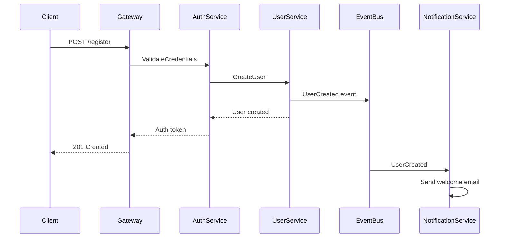
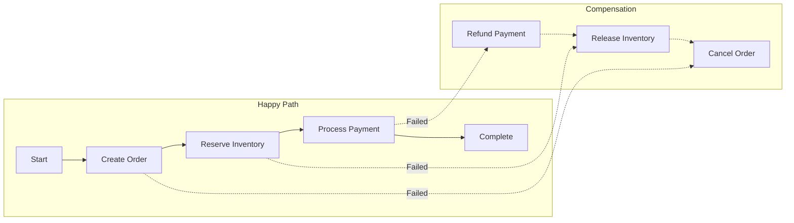
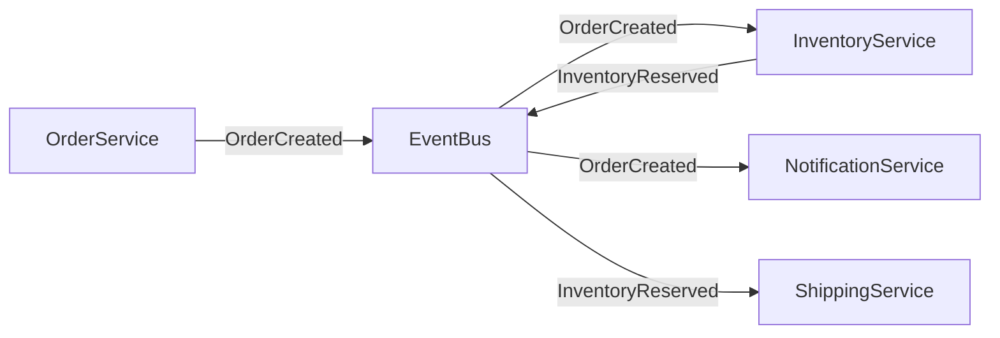
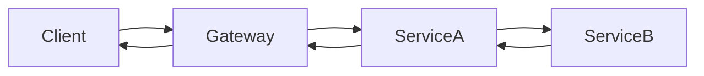

# Integration Patterns
<!-- Status: Draft -->
<!-- Last Updated: YYYY-MM-DD -->

End-to-end flows—how the nouns move via the verbs.

## Key Flows

### {Flow Name} (e.g., User Registration)

**Trigger**: {What initiates this flow - user action, scheduled job, event}
**Outcome**: {What the flow accomplishes when successful}
**SLA**: {Expected duration, e.g., <500ms}

**Error Handling**:

| Error | Handler | HTTP | Recovery |
|-------|---------|------|----------|
| Duplicate email | AuthService | 409 | Return existing user hint |
| Validation failed | Gateway | 400 | Return field errors |
| Database timeout | UserService | 503 | Retry with backoff |

**Data Transformations**:

| Step | Input | Output |
|------|-------|--------|
| Gateway | HTTP JSON | Internal DTO |
| AuthService | DTO | User entity |
| EventBus | User entity | Schema.org/Person event |

### {Another Flow}

{Same structure}

## Cross-Boundary Patterns

### Saga Pattern

**Use when**: Multi-service transactions requiring rollback capability.

**Implementation**:
- Orchestrator: {service name}
- State storage: {where saga state is stored}
- Timeout: {how long before auto-compensation}

### Event Choreography

**Use when**: Loosely coupled services reacting to domain events.

**Guidelines**:
- Events are facts (past tense: `OrderCreated`, not `CreateOrder`)
- Each consumer is idempotent
- Events include correlation ID for tracing

### Request/Response (Sync)

**Use when**: Immediate response required, tight consistency needed.

**Guidelines**:
- Timeout: {default timeout}
- Retries: {retry policy}
- Circuit breaker: {threshold}

## Anti-Patterns

| Pattern | Problem | Alternative |
|---------|---------|-------------|
| Chatty services | Many small calls = latency | Batch operations |
| Distributed transactions | 2PC doesn't scale | Saga pattern |
| Sync for fire-and-forget | Unnecessary coupling | Events |
| Events for queries | Eventual consistency issues | Sync call |

## Related Documents

- [Shared Concepts](shared-concepts.md) - The entities in these flows
- [Communication Protocols](communication-protocols.md) - The transports used
- [Cross-Cutting Concerns](cross-cutting-concerns.md) - Auth, tracing in flows

---

*Integration patterns - how components interact*
