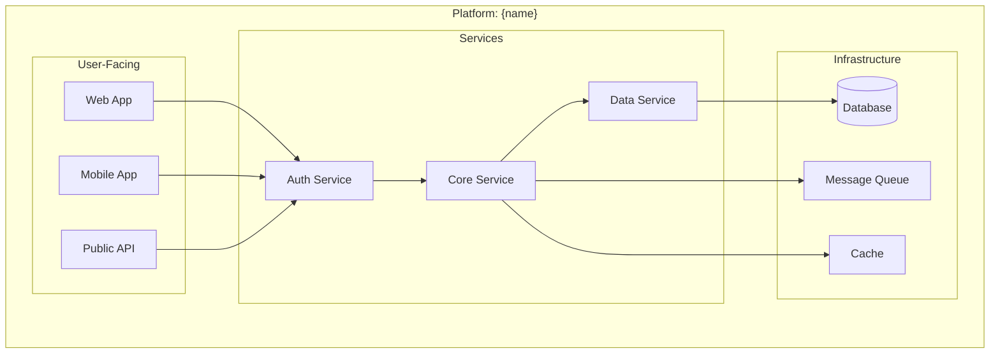

# Platform Overview
<!-- Status: Draft -->
<!-- Last Updated: YYYY-MM-DD -->

The 30,000 foot view of {platform-name}.

## What Is This Platform?

{2-3 sentence executive summary explaining what this platform does, who uses it, and its primary value proposition.}

## Project Map

## Repository Structure

| Repository | Purpose | Team | Status |
|------------|---------|------|--------|
| {repo-name} | {brief purpose} | {owning team} | {active/maintenance} |

## Deployment Context

### Environments

| Environment | Purpose | URL |
|-------------|---------|-----|
| Production | Live traffic | {url} |
| Staging | Pre-release testing | {url} |
| Development | Active development | {url} |

### Infrastructure

- **Cloud Provider**: {AWS/GCP/Azure}
- **Regions**: {primary}, {failover}
- **Orchestration**: {Kubernetes/ECS/etc}

## Key Metrics

| Metric | Target | Current |
|--------|--------|---------|
| Availability | 99.9% | {current} |
| P99 Latency | <200ms | {current} |
| Error Rate | <0.1% | {current} |

## Related Documents

- [Shared Concepts](shared-concepts.md) - Domain vocabulary
- [Communication Protocols](communication-protocols.md) - How services talk
- [Integration Patterns](integration-patterns.md) - End-to-end flows

---

*Platform overview - the 30,000 foot view*
