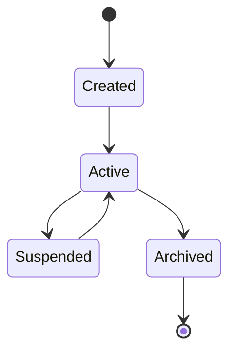

# Shared Concepts
<!-- Status: Draft -->
<!-- Last Updated: YYYY-MM-DD -->

The nouns of the system—domain entities, semantic vocabulary, shared language.

## Core Domain Entities

### {Entity Name}

**Definition**: {What this entity represents in the business domain}

**Attributes**:

| Attribute | Type | Required | Description |
|-----------|------|----------|-------------|
| id | string | Yes | Unique identifier (format: `{prefix}_{ulid}`) |
| name | string | Yes | Human-readable name |
| createdAt | datetime | Yes | When entity was created |
| updatedAt | datetime | Yes | Last modification time |

**Relationships**:
- Has many {related entity}
- Belongs to {parent entity}
- References {external entity}

**Schema.org Mapping**: `schema.org/{Type}`

**Lifecycle States**:


### {Another Entity}

{Same structure}

## Semantic Vocabulary

Terms used consistently across all services and documentation.

| Term | Definition | Context |
|------|------------|---------|
| {term} | {precise definition} | {where this term is used} |
| {term} | {precise definition} | {where this term is used} |

## Namespace Model

How multi-tenancy and organizational hierarchy work.

```
Organization (tenant boundary)
└── Workspace (collaboration boundary)
    └── Project (resource boundary)
        └── Resource (individual entity)
```

| Level | Isolation | Sharing |
|-------|-----------|---------|
| Organization | Complete | None |
| Workspace | Data | Organization settings |
| Project | Configuration | Workspace members |

## Entity Identifiers

Consistent ID formats across the platform.

| Entity | Prefix | Format | Example |
|--------|--------|--------|---------|
| User | `usr` | `usr_{ulid}` | `usr_01H5K3ABCD1234567890` |
| Organization | `org` | `org_{ulid}` | `org_01H5K3ABCD1234567890` |
| {Entity} | `{pfx}` | `{pfx}_{ulid}` | `{pfx}_01H5K3ABCD1234567890` |

## Glossary

Quick reference for platform terminology.

| Term | Definition |
|------|------------|
| {term} | {definition} |
| {term} | {definition} |
| {term} | {definition} |

## Related Documents

- [Communication Protocols](communication-protocols.md) - How entities are transmitted
- [Integration Patterns](integration-patterns.md) - How entities flow through the system

---

*Shared concepts - the nouns of the system*
