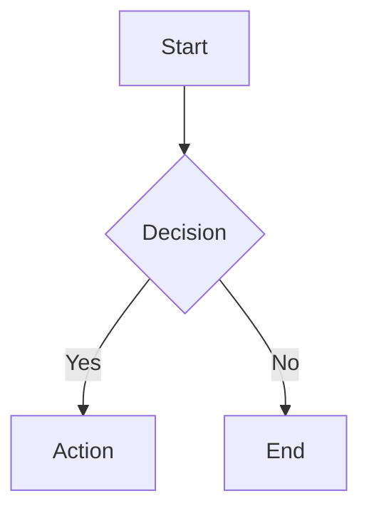

<objective>
Ensure all markdown documents have consistent structure with proper header metadata and footer change history. Standardizes documentation across projects regardless of type (workspace, monorepo, ontology, etc.).
</objective>

<scope>
<applies_to>
- Research notes and findings
- Analysis reports
- Context documents
- Design documents
- Meeting notes
- Technical documentation
- Any general-purpose markdown file
</applies_to>

<does_not_apply_to>
- Subagent definitions (agents/*.md)
- Slash commands (commands/*.md)
- Skills (SKILL.md files)
- README.md files (these have their own conventions)
- CLAUDE.md files
- CHANGELOG.md files
</does_not_apply_to>
</scope>

<quick_start>
<workflow_new_document>
When CREATING a new markdown file:
1. Check if document type is excluded (subagent, command, skill) → MUST stop if excluded
2. If path provided by user, use it; otherwise determine appropriate location
3. Classify document type
4. Generate header with required metadata
5. Write document content
6. Add footer with change history (initial creation entry)
</workflow_new_document>

<workflow_update_document>
When UPDATING an existing markdown file:
1. Check if document type is excluded (subagent, command, skill) → MUST stop if excluded
2. If document lacks proper header/footer, add them
3. Make the requested content changes
4. Update the Change History table in footer with new entry
</workflow_update_document>

<quality_requirements>
**Markdown Lint Compliance**:
- All produced markdown must be free from lint errors
- Use consistent heading levels (no skipping levels)
- Blank lines before and after headings, code blocks, and lists
- No trailing whitespace
- Single blank line at end of file
- Properly closed code fences with language specifier

**Diagrams**:
- All diagrams MUST use Mermaid format
- Use fenced code blocks with `mermaid` language identifier
- Supported diagram types: flowchart, sequence, class, state, ER, gantt, pie, mindmap

Example:

</quality_requirements>

<path_behavior>
If user provides a specific file path:
- MUST use that path exactly
- NEVER suggest alternatives
- NEVER question the location

If NO path provided, determine based on document type and project structure.
</path_behavior>
</quick_start>

<document_classification>
Classify every document into ONE of these categories:

<category name="external-research">
**External Research Finding**
- Information gathered from outside sources
- Web research, API documentation, third-party analysis
- Competitor analysis, market research
- Directory suggestion: `research/` or `docs/research/`
</category>

<category name="internal-analysis">
**Internal Analysis Report**
- Analysis of internal systems, code, or processes
- Performance reports, architecture reviews
- Code quality assessments, technical debt analysis
- Directory suggestion: `analysis/` or `docs/analysis/`
</category>

<category name="contextual">
**Contextual Document**
- Background information for ongoing work
- Project context, decision rationale
- Historical context, migration notes
- Directory suggestion: `context/` or `docs/context/`
</category>

<category name="other">
**Other**
- Documents that don't fit above categories
- Meeting notes, scratch documents, miscellaneous
- Directory suggestion: `docs/` or project root
</category>
</document_classification>

<header_template>
Every document MUST start with this header structure:

```markdown
---
document: [Document Name]
created: [YYYY-MM-DD HH:MM]
classification: [external-research | internal-analysis | contextual | other]
---

**Purpose**: [What this document is for]
**Author**: [Who created it - can be "Claude" or user name]
**Context**: [Why this document was created - what prompted it]

---
```

<field_guidance>
- **document**: Clear, descriptive name (not the filename)
- **created**: Current date and time when document is first created
- **classification**: One of the four categories above
- **Purpose**: 1-2 sentences on what the document achieves
- **Author**: Who or what produced this document
- **Context**: The triggering event or need that led to creation
</field_guidance>
</header_template>

<footer_template>
Every document MUST end with this footer structure:

```markdown
---

## Change History

| Date | Change | Author |
|------|--------|--------|
| [YYYY-MM-DD] | Initial creation | [Author] |
```

<update_behavior>
After EVERY modification to the document:
1. Add a new row to the Change History table
2. Include date, brief description of change, and who made it
3. Keep entries in reverse chronological order (newest first)

Example after updates:
```markdown
## Change History

| Date | Change | Author |
|------|--------|--------|
| 2024-03-15 | Added section on error handling | Claude |
| 2024-03-14 | Expanded API examples | User |
| 2024-03-14 | Initial creation | Claude |
```
</update_behavior>
</footer_template>

<complete_example>
```markdown
---
document: Authentication Flow Analysis
created: 2024-03-14 09:30
classification: internal-analysis
---

**Purpose**: Document the current authentication flow and identify potential improvements
**Author**: Claude
**Context**: User requested security review of login system

---

[Document content goes here...]

---

## Change History

| Date | Change | Author |
|------|--------|--------|
| 2024-03-14 | Initial creation | Claude |
```
</complete_example>

<success_criteria>
Document is correctly structured when:
- Header contains all required fields (document, created, classification)
- Purpose, Author, and Context are clearly stated
- Classification matches document content
- Footer has Change History table
- Change History is updated after every modification
- Path respects user-provided location or follows classification-based suggestion
- Markdown is lint-free (proper spacing, heading levels, code fences)
- Any diagrams use Mermaid format
</success_criteria>

<anti_patterns>
<avoid>
- Creating documents without headers
- Skipping change history updates
- Overriding user-specified paths
- Applying this to subagents, commands, or skills
- Using vague document names like "Notes" or "Document"
- Leaving Purpose/Author/Context empty
- Producing markdown with lint errors (missing blank lines, skipped heading levels)
- Using ASCII art, PlantUML, or other diagram formats instead of Mermaid
- Code fences without language specifiers
</avoid>
</anti_patterns>
