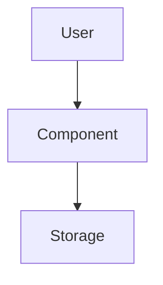

# [Component Name]: Design Document (Modular)

<!-- 
LLM INSTRUCTION:
This is a MODULAR template. Follow these steps:
1. Review the Quick Start Profiles below and identify your project type.
2. Use ONLY the sections marked for your profile.
3. DELETE or skip all Extension sections not tagged for your domain.
4. The result should be a clean, focused document (not a 200-line monster).
-->

**Version**: {{VERSION}}
**Status**: {{STATUS}} (e.g., Draft, Proposed, Approved)
**Implementation**: [Link to Implementation Doc]

---

## Quick Start Profiles

Select the profile closest to your project and use ONLY the listed sections:

| Profile | Use Sections | Domain Tags |
|---------|--------------|-------------|
| **Simple Utility/Script** | CORE only | N/A |
| **REST API / Web Service** | CORE + [WEB] | WEB, API |
| **Data Pipeline / ETL** | CORE + [DATA] | DATA, INTEGRATION |
| **ML/AI Service** | CORE + [ML] [DATA] | ML, DATA |
| **IoT / Hardware** | CORE + [IOT] [HARDWARE] | IOT, HARDWARE |
| **Mobile / Frontend** | CORE + [MOBILE] [WEB] | MOBILE, FRONTEND |
| **Finance / Trading** | CORE + [FINANCE] [DATA] | FINANCE, REGULATED |
| **Healthcare** | CORE + [HEALTH] [REGULATED] | HEALTH, REGULATED |
| **Platform / Infra** | CORE + [PLATFORM] [OPS] | PLATFORM, OPS |
| **Media / Streaming** | CORE + [MEDIA] | MEDIA |
| **Geospatial** | CORE + [GEO] [DATA] | GEO, DATA |

---

## Document Hierarchy (Source of Truth)

1. **Design** (This Document): Governs intent, behavior, user experience, and "why".
2. **Implementation**: Governs file paths, class names, signatures, and technical specifics.
3. **Execution Plan**: Governs the order of operations and testing strategy.

---

## PART A: CORE (Mandatory - All Projects)

### 1. Problem Statement [CORE]
<!-- What are we solving? Who is it for? -->
{{PROBLEM_DESCRIPTION}}

### 2. Alternative Solutions Considered [CORE]
<!-- Briefly describe 2-3 approaches and why they were rejected. -->

**Solution A**: {{NAME}}
- **Pros**: {{PROS}}
- **Cons**: {{CONS}}

**Solution B**: {{NAME}} (Selected)
- **Why**: {{JUSTIFICATION}}

### 3. Proposed Solution [CORE]

#### 3.1 Architecture Overview [CORE]


#### 3.2 Public Interface & Usage [CORE]
<!-- How do others use this? Code snippets or API definitions. -->
```python
result = my_component.do_thing()
```

#### 3.3 Data Flow / Workflow [CORE]
<!-- Describe how data moves through the system. -->
1. Step 1
2. Step 2
3. Step 3

### 4. Success Criteria [CORE]
<!-- Checklist of what "Done" looks like. -->
- [ ] {{CRITERIA_1}}
- [ ] {{CRITERIA_2}}

---

## PART B: EXTENSIONS (Domain-Specific - Use Only If Tagged)

<!-- DELETE ALL SUBSECTIONS BELOW THAT DON'T MATCH YOUR DOMAIN TAGS -->

### 5. Data Strategy [DATA] [ML] [INTEGRATION]
<!-- Schema, Mapping, Lineage, Quality. -->
- **Data Model**: ER Diagram / Graph / JSON Schema.
- **Access Patterns**: Top 3-5 queries.
- **Mapping**: `Source.Field` -> `Target.Field`.
- **Quality Rules**: `age > 0`.

### 6. Logic & Algorithms [ML] [FINANCE] [GAME] [GEO]
<!-- State Machines, Math, Transactions. -->
- **Algorithm**: BM25 / Verlet Integration.
- **State Machine**: Created -> Paid -> Shipped.
- **Transactions**: 2-Phase Commit.

### 7. User Experience [WEB] [MOBILE] [FRONTEND]
<!-- UI States, A11y, i18n. -->
- **UI States**: Loading, Error, Empty, Success.
- **A11y**: WCAG 2.1 AA.
- **i18n**: RTL Support.

### 8. System & Operations [PLATFORM] [OPS] [IOT] [HARDWARE]
<!-- Connectivity, Parallelization, Low-level, Control Loops. -->
- **Offline Strategy**: Store-and-Forward.
- **Parallelization**: MPI Scatter-Gather.
- **Low-Level**: Stack-only / Real-time < 1ms.
- **Control Loop**: Observe -> Diff -> Act.

### 9. Domain Specifics [MEDIA] [GEO] [HEALTH] [FINANCE] [IOT]
<!-- Highly specialized domain details. -->
- **[MEDIA]** Codecs: H.264 + Widevine DRM.
- **[GEO]** Coordinate System: EPSG:4326 (WGS84).
- **[HEALTH]** Standards: FHIR R4 / DICOM.
- **[FINANCE]** Protocols: FIX 4.4.
- **[IOT]** Hardware: POS Printer (ESC/POS).

### 10. Security, Compliance & Risk [REGULATED] [FINANCE] [HEALTH]
<!-- Security boundaries, Compliance, Safety. -->
| Risk | Mitigation |
|------|------------|
| {{RISK}} | {{MITIGATION}} |

- **Compliance**: GDPR/HIPAA/KYC.
- **Supply Chain**: SBOM / SLSA.
- **Certification**: IEC 61508 SIL 2.

### 11. Performance & Scalability [API] [DATA] [FINANCE] [PLATFORM]
<!-- Latency, Throughput, Consistency. -->
- **Latency**: < 100ms p95 (or < 100us for HFT).
- **Throughput**: 1000 req/sec.
- **Consistency**: Strong vs Eventual.

### 12. Business & Growth [WEB] [MOBILE] [GROWTH]
<!-- Cost, SEO, Documentation, Experiments. -->
- **Cost**: Max $10/day.
- **SEO**: JSON-LD Schema.
- **Docs**: OpenAPI v3.
- **Experiments**: A/B Test Pricing.

---

## Final Checklist (Core Decisions)

### Key Design Decisions [CORE]
1. **{{DECISION_TITLE}}**: {{RATIONALE}}
2. **{{DECISION_TITLE}}**: {{RATIONALE}}
