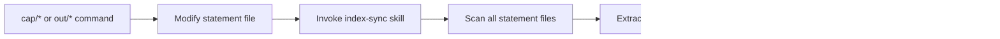

# WS Plugin Design Document

Comprehensive architecture for capability-based software development workspace management.

**Version**: 0.8.0
**Purpose**: Enable implementation of new commands, skills, subagents, and hooks with complete context.

---

## Table of Contents

1. [Plugin Structure](#1-plugin-structure)
2. [Plugin Metadata](#2-plugin-metadata)
3. [Command Patterns](#3-command-patterns)
4. [Skill Patterns](#4-skill-patterns)
5. [Agent Architecture](#5-agent-architecture)
6. [Hook Patterns](#6-hook-patterns)
7. [Schema System](#7-schema-system)
8. [Templates](#8-templates)
9. [Data Flow](#9-data-flow)
10. [Naming Conventions](#10-naming-conventions)
11. [Architectural Decisions](#11-architectural-decisions)
12. [Creating New Components](#12-creating-new-components)
13. [Constraints](#13-constraints)
14. [Glossary](#14-glossary)

---

## 1. Plugin Structure


### Directory Layout

```
plugins/ws/
├── plugin.json                      # Plugin metadata & declarations
├── README.md                        # User-facing documentation
├── CHANGELOG.md                     # Release history
├── design.md                        # This file
│
├── commands/                        # Slash commands
│   ├── cap/                        # Capability commands
│   │   ├── create.md, list.md, check.md
│   │   ├── edit.md, delete.md
│   │   └── merge.md, split.md
│   ├── out/                        # Outcome commands
│   │   ├── create.md, check.md
│   ├── exe/                        # Execution commands
│   │   ├── list.md, stage.md
│   ├── plan/                       # Planning commands
│   │   └── create.md
│   ├── enviro.md                  # Environment management
│   ├── version.md                 # Display version
│   └── report-bug.md              # Bug reporting
│
├── skills/                         # Reusable workflows
│   ├── git-commits/SKILL.md
│   ├── capability-index-sync/SKILL.md
│   └── outcome-index-sync/SKILL.md
│
├── agents/                         # Specialized subagents
│   ├── capability-checker.md
│   ├── outcome-checker.md
│   └── toon-specialist.md          # Central TOON gateway
│
├── hooks/                          # Python lifecycle scripts
│   ├── session_start.py            # SessionStart trigger
│   ├── focus_tracker.py            # PostToolUse trigger
│   └── capability_sync.py          # PostToolUse trigger
│
├── scripts/src/workspace_info/     # Python utilities
│
└── templates/                      # Output templates
    ├── capability-statement-template.md
    ├── outcome-statement-template.md
    ├── execution-plan-template.md
    └── execution-completion-template.md
```

---

## 2. Plugin Metadata

**File**: `plugin.json`

```json
{
  "name": "ws",
  "displayName": "Workspace",
  "description": "Capability-based software development workspace management",
  "version": "0.8.0",
  "dependencies": {
    "claudeCode": ">=1.0.0",
    "python": ">=3.10"
  },
  "commands": [
    "ws:version", "ws:report-bug", "ws:enviro",
    "cap:create", "cap:list", "cap:check", "cap:edit",
    "cap:delete", "cap:merge", "cap:split",
    "out:create", "out:check",
    "exe:list", "exe:stage",
    "plan:create"
  ],
  "skills": [
    "git-commits",
    "capability-index-sync",
    "outcome-index-sync"
  ],
  "agents": [
    "capability-checker",
    "outcome-checker",
    "toon-specialist"
  ],
  "hooks": {
    "SessionStart": ["python3 hooks/session_start.py"],
    "PostToolUse": [
      "python3 hooks/focus_tracker.py",
      "python3 hooks/capability_sync.py"
    ]
  },
  "schemas": [
    "../../shared/schemas/workspace-info-schema.toon",
    "../../shared/schemas/capabilities-info-schema.toon",
    "../../shared/schemas/outcomes-info-schema.toon",
    "../../shared/schemas/execution-info-schema.toon",
    "../../shared/schemas/core-values-schema.toon",
    "../../shared/schemas/actor-registry-schema.toon"
  ],
  "templates": [
    "capability-statement-template.md",
    "outcome-statement-template.md",
    "execution-plan-template.md",
    "execution-completion-template.md"
  ],
  "sharedLibraries": ["../../shared/cli-commons"]
}
```

---

## 3. Command Patterns

### YAML Frontmatter

All commands use YAML frontmatter for metadata:

```yaml
---
description: User-facing command description
argument-hint: [optional: what arguments it accepts]
allowed-tools: [optional: list of tools this command uses]
model-hint: [optional: haiku|sonnet for cost optimization]
---
```

### Command Structure

Each command file follows this structure:

```markdown
---
description: ...
argument-hint: ...
---

<objective>
What the command achieves in 2-3 sentences.
</objective>

<critical_constraints>
**FORMAT REQUIREMENTS - MUST FOLLOW:**
1. First constraint...
2. Second constraint...
</critical_constraints>

<context>
**Files to Read:**
| Purpose | Path |
|---------|------|
| ... | ... |
</context>

<process>
## Phase 1: [Name]
1. Step one...
2. Step two...

## Phase 2: [Name]
...
</process>

<anti_patterns>
| Wrong | Right | Why |
|-------|-------|-----|
| ... | ... | ... |
</anti_patterns>

<output>
Description of files created.
</output>

<output_format>
TOON-formatted response template.
</output_format>

<epilogue>
Post-execution actions (skill invocations).
</epilogue>

<success_criteria>
- Criterion 1
- Criterion 2
</success_criteria>
```

### Key Command Examples

**cap:create** - Creates capability statement
- Uses YAML frontmatter as single source of truth
- Maps to 1-3 core values from 34-value framework
- Requires actor involvement with kebab-case IDs
- All 4 maturity milestones (30/60/80/100%)
- Invokes capability-checker for validation
- Syncs via capability-index-sync skill

**out:create** - Creates outcome statement
- Outcome IDs: `{sequence}-{name}` or `{parent}.{child}-{name}`
- 2+ observable effects in Given-When-Then format
- Links to capabilities with maturity contributions
- Creates directory: `outcomes/queued/{outcome-id}/`

**enviro** - Environment management
- Idempotent: setup/repair/migrate/report
- 4 parallel scanner subagents
- toon-specialist produces all .toon files
- Detects state: virgin/healthy/outdated/corrupted

---

## 4. Skill Patterns

### Skill Structure

**Location**: `skills/{name}/SKILL.md`

```markdown
---
name: skill-name
description: What this skill does (third person, with trigger terms)
---

<objective>
What the skill achieves.
</objective>

<quick_start>
Minimal invocation example.
</quick_start>

<context>
Files and schemas used.
</context>

<process>
Step-by-step workflow.
</process>

<constraints>
Rules and limitations.
</constraints>

<success_criteria>
How to verify completion.
</success_criteria>
```

### Existing Skills

| Skill | Purpose |
|-------|---------|
| `git-commits` | Commit format with scope hierarchy and purpose |
| `capability-index-sync` | Regenerate capabilities-info.toon after cap/* |
| `outcome-index-sync` | Regenerate outcomes-info.toon after out/* |

---

## 5. Agent Architecture

### toon-specialist (Central Gateway)

**Role**: Exclusive producer of all .toon files


**Access Control**:

| Operation | Any Command | toon-specialist ONLY |
|-----------|-------------|---------------------|
| Read instance .toon files | Yes | Yes |
| Use TOON in messages | Yes | Yes |
| Read *-schema.toon files | No | Yes |
| Write .toon files | No | Yes |
| Know schema locations | No | Yes |

**Operations**:

```toon
# PRODUCE - Generate TOON files from data
@type: CreateAction
name: produce
object.schema: workspace-info-schema.toon
object.output: .claude/workspace-info.toon
object.data: {...structured data...}

# VALIDATE - Check existing TOON files
@type: AssessAction
name: validate
object.path: .claude/workspace-info.toon
object.schema: workspace-info-schema.toon

# PARSE - Extract data from TOON files
@type: AnalyzeAction
name: parse
object.path: .claude/workspace-info.toon
object.extract[N]: field1,field2,field3

# CONVERT - Transform between formats
@type: UpdateAction
name: convert
object.source: {...data or path...}
object.target: output.toon
object.schema: schema-name.toon
```

### capability-checker

**Purpose**: Validate capability-statement.md files

**Checks**:
- YAML frontmatter presence and structure
- Required fields (identifier, name, type, status, domain, maturity)
- Actor IDs in kebab-case
- Content completeness
- Placeholder detection (TBD/TODO)
- Cross-reference integrity
- Spelling/grammar/markdown lint

**Output**: VALID | NEEDS_ATTENTION | INVALID

### outcome-checker

**Purpose**: Validate outcome directories

**Checks**:
- File structure (outcome-statement.md)
- Achievement focus (no process prescriptions)
- Observable effects (behavioral Given-When-Then)
- Capability alignment & proportionality
- Parent/child relationships
- Contribution math (children sum to 100%)

**Output**: VALID | NEEDS_ATTENTION | INVALID

---

## 6. Hook Patterns

All hooks use shared library: `shared/cli-commons`

### Hook Structure

```python
from workspace_info import HookContext, WorkspaceInfo

def main():
    ctx = HookContext.from_stdin("hook_name")

    # Get context
    tool_name = ctx.tool_name
    tool_input = ctx.tool_input
    project_dir = ctx.project_dir

    # Perform action
    ws = WorkspaceInfo(project_dir)
    # ... modify workspace-info.toon ...

    return 0  # success

if __name__ == "__main__":
    sys.exit(main())
```

### Existing Hooks

| Hook | Trigger | Purpose |
|------|---------|---------|
| `session_start.py` | SessionStart | Init/update workspace-info.toon |
| `focus_tracker.py` | PostToolUse | Track activity focus |
| `capability_sync.py` | PostToolUse | Mark indexes stale on capability edits |

---

## 7. Schema System

### Schema Registry

Schemas in `shared/schemas/` for cross-plugin reuse:

| Schema | Instance Location | Purpose |
|--------|-------------------|---------|
| `workspace-info-schema.toon` | `.claude/workspace-info.toon` | Main workspace snapshot |
| `capabilities-info-schema.toon` | `.claude/capabilities-info.toon` | Capabilities index |
| `outcomes-info-schema.toon` | `.claude/outcomes-info.toon` | Outcomes index |
| `execution-info-schema.toon` | `.claude/execution-info.toon` | Execution tracking |
| `core-values-schema.toon` | (reference only) | 34-value framework |
| `actor-registry-schema.toon` | (reference only) | Actor definitions |

### TOON Syntax

```toon
@context: https://schema.org
@type: ItemList
@id: capabilities-index
dateModified: 2025-12-02T14:30:00Z

# Nested property with type
summary@type: PropertyValue
summary.totalCapabilities: 5
summary.averageMaturity: 42%

# Tabular array with header
capability.index{identifier,name,type,status,maturity|tab}:
auth-system	Authentication System	atomic	active	45%
data-pipeline	Data Pipeline	composed	active	20%
```

**Key Syntax**:
- `key: value` - Colon-space separator
- `parent.child: value` - Dot notation for nesting
- `parent@type: TypeName` - Typed blocks
- `key{col1,col2|tab}:` - Tabular arrays
- `# text` - Comments
- `45%` - Percentages
- `key: null` - Null values

---

## 8. Templates

Output templates in `templates/`:

| Template | Purpose |
|----------|---------|
| `capability-statement-template.md` | YAML frontmatter + markdown sections |
| `outcome-statement-template.md` | Observable effects in Given-When-Then |
| `execution-plan-template.md` | Implementation planning |
| `execution-completion-template.md` | Completion documentation |

### Capability Statement Structure

```yaml
---
identifier: capability-id
name: Human-Readable Name
type: atomic | composed
status: active | deprecated | planned
domain: business-domain
maturity:
  current: 0
  target: 100
values:
  - value-1
  - value-2
actors:
  - id: actor-id
    role: primary | supporting | affected
---

## Purpose
...

## Value Proposition
...

## Maturity Milestones
### 30% - Foundation
...
```

### Outcome Statement Structure

```yaml
---
identifier: 005-outcome-name
name: Human-Readable Name
stage: queued | ready | in-progress | blocked | completed
priority: P1 | P2 | P3
achievement: What to accomplish
tokenBudget: very-low | low | average | high
capabilityContributions:
  - capabilityId: cap-id
    contribution: 15
---

## Observable Effects

### Effect 1: [Name]
**Given** [precondition]
**When** [action]
**Then** [observable result]
```

---

## 9. Data Flow

### Component Interaction


### Capability Creation Flow


### Environment Setup Flow


### Index Sync Flow



---

## 10. Naming Conventions

### Capability IDs

**Pattern**: `^[a-z0-9]+(-[a-z0-9]+)*$`

| Example | Valid |
|---------|-------|
| `auth-system` | Yes |
| `data-pipeline` | Yes |
| `user-management` | Yes |
| `AuthSystem` | No |
| `auth_system` | No |

**Directory**: `capabilities/{capability-id}/`

### Outcome IDs

**Standalone**: `^[0-9]+-[a-z0-9]+(-[a-z0-9]+){0,4}$`

| Example | Valid |
|---------|-------|
| `001-jwt-auth` | Yes |
| `005-data-model` | Yes |

**Child**: `^[0-9]+\.[0-9]+-[a-z0-9]+(-[a-z0-9]+){0,4}$`

| Example | Valid |
|---------|-------|
| `001.1-session-mgmt` | Yes |
| `005.2-audit-logging` | Yes |

**Directory**: `outcomes/{stage}/{outcome-id}/`

### Actor IDs

**Pattern**: `^[a-z0-9]+(-[a-z0-9]+)*$`

| Example | Valid |
|---------|-------|
| `lot-owner` | Yes |
| `strata-manager` | Yes |
| `platform-developers` | Yes |
| `Lot Owner` | No |
| `StrataManager` | No |

---

## 11. Architectural Decisions

### AD-1: YAML Frontmatter as Single Source of Truth

Capability and outcome tracking data lives in YAML frontmatter, not separate JSON files.

**Rationale**:
- Machine-parseable with human-readable body
- Single file per entity (cleaner)
- Scanners extract frontmatter for indexes
- Deprecates capability_track.json

### AD-2: toon-specialist as Exclusive Gateway

Only toon-specialist reads schema files and writes .toon files.


**Rationale**:
- Single source of truth for TOON format
- Consistent validation
- Clear separation: data gathering vs. format production
- Other components pass structured data, not raw text

### AD-3: Observable Effects Must Be Behavioral

Effects describe user-observable behavior, not implementation artifacts.

**Valid**:
```gherkin
Given user is authenticated
When user requests protected resource
Then access is granted
```

**Invalid**:
```gherkin
Given unit tests written
When tests run
Then coverage > 80%
```

**Rationale**:
- Focus on WHAT, not HOW
- Effects prove capability maturity
- Verifiable by stakeholders

### AD-4: Parallel Subagent Execution

Launch multiple independent tasks in single message.

**Rationale**:
- Minimize main context token usage
- Faster execution
- Subagents return compact TOON only

### AD-5: Outcome Hierarchy with Contribution Math

Children's parentContribution must sum to 100%.


**Rationale**:
- Clear accountability
- Prevents duplicate capability attribution
- Maturity calculated from child completion

---

## 12. Creating New Components

### New Command

1. Create `commands/{category}/{action}.md`
2. Include YAML frontmatter with description
3. Add sections: objective, constraints, context, process, output_format
4. Delegate to agents for validation/TOON production
5. Invoke sync skills to update indexes
6. Add command name to plugin.json `commands` array

### New Skill

1. Create `skills/{name}/SKILL.md`
2. Include YAML frontmatter with name, description
3. Add sections: objective, quick_start, process, constraints, success_criteria
4. Add skill name to plugin.json `skills` array

### New Agent

1. Create `agents/{name}.md`
2. Include YAML frontmatter with name, description, tools, model
3. Add sections: role, input, constraints, workflow, output_format
4. For TOON production, delegate to toon-specialist
5. Add agent name to plugin.json `agents` array

### New Hook

1. Create `hooks/{name}.py`
2. Import from `workspace_info` (shared library)
3. Use `HookContext.from_stdin()` for context
4. Return 0 for success, non-zero for failure
5. Add to plugin.json `hooks` object under appropriate trigger

### New Schema

1. Create `shared/schemas/{name}-schema.toon`
2. Include schema metadata header with $schema, $instance, $generator
3. Document field types and constraints
4. Update toon-specialist schema registry table
5. Add path to plugin.json `schemas` array

### New Template

1. Create `templates/{type}-template.md`
2. Include YAML frontmatter example with all fields
3. Show all markdown sections with guidance
4. Include anti-patterns and quality checklist
5. Add path to plugin.json `templates` array

---

## 13. Constraints

1. **NO direct .toon file writes** - Only toon-specialist writes .toon files
2. **YAML frontmatter is single source of truth** - For capabilities and outcomes
3. **NO placeholder text** - Replace TBD/TODO with concrete values
4. **Observable effects are behavioral** - Not implementation artifacts
5. **All IDs are kebab-case** - Never Title Case or snake_case
6. **Outcome hierarchy has strict math** - Children sum to 100%
7. **Commands delegate validation** - To capability-checker or outcome-checker
8. **Parallel execution preferred** - Launch independent tasks together
9. **TOON is line-oriented** - No indentation nesting
10. **Achievement-focused language** - Describe WHAT not HOW

---

## 14. Glossary

| Term | Definition |
|------|------------|
| **Capability** | Strategic goal with maturity % (0-100%) |
| **Atomic Capability** | Built from completed outcomes |
| **Composed Capability** | Built from sub-capabilities |
| **Outcome** | Tactical work unit building a capability |
| **Parent Outcome** | Decomposes into child outcomes |
| **Child Outcome** | Contributes % to parent |
| **Observable Effect** | Behavioral result (Given-When-Then) |
| **Maturity Milestone** | Threshold: 30/60/80/100% |
| **Core Values** | 34-value framework |
| **Actor** | Stakeholder with capability relationship |
| **Contribution** | % of capability maturity from outcome |
| **TOON** | Token-Optimized Object Notation |
| **Index File** | Summary snapshot (.toon) |
| **Schema** | Reference definition |
| **Instance** | Actual workspace file |
| **Hook** | Python script on lifecycle trigger |
| **Subagent** | Specialized agent |
| **Scanner** | Explore agent gathering data |
